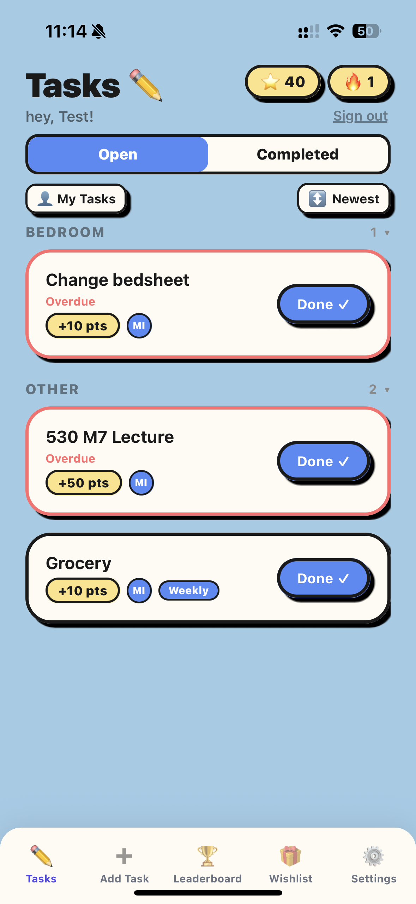
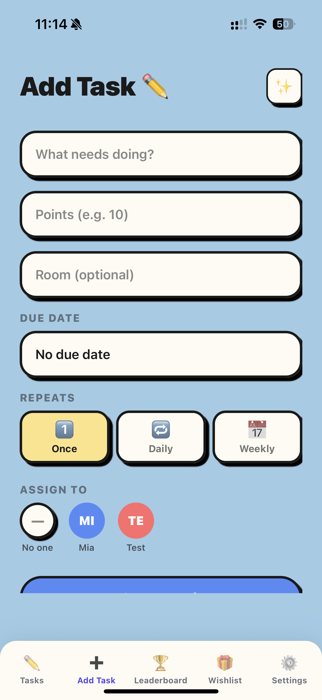
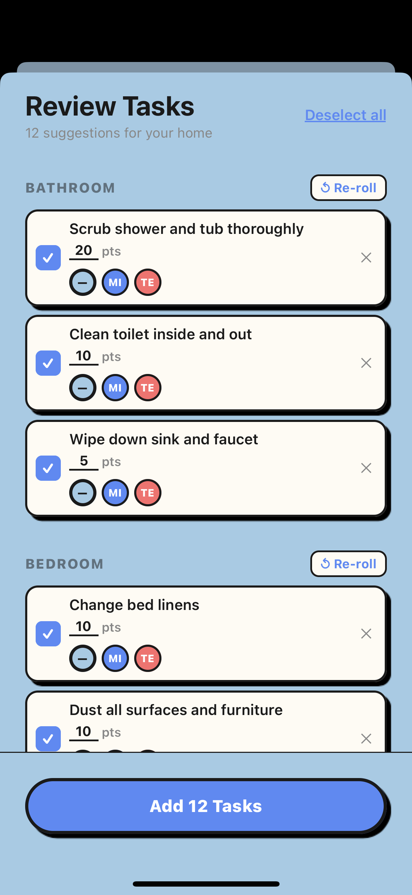
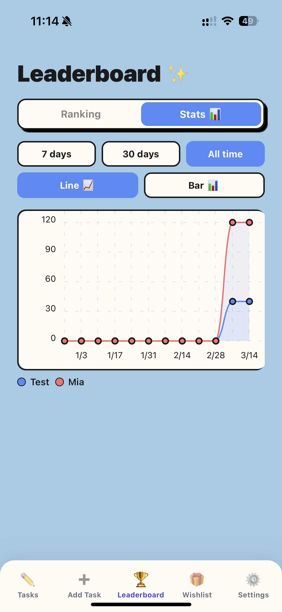
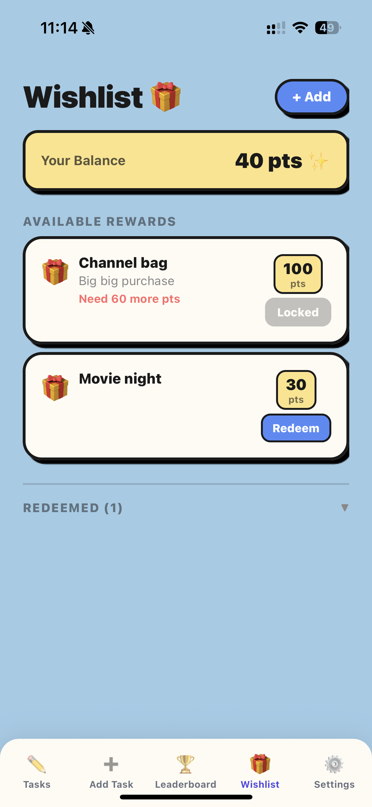
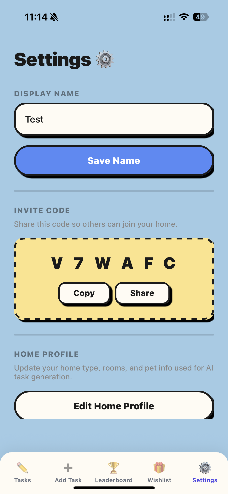

# TidyUp — App Demo

A multi-user household task manager with gamified rewards. Built with **Expo + React Native**, **TypeScript**, and **Supabase**.

---

## Screenshots

### Tasks
Browse open chores grouped by room, see who they're assigned to, and mark them done to earn points. Overdue tasks are highlighted in red.

---

### Add Task
Create a task with a title, point value, optional room, due date, repeat schedule (once / daily / weekly), and assign it to a household member.

---

### AI Task Suggestions
Generate a tailored chore list based on your home profile (rooms, pets, etc.). Re-roll suggestions per room and bulk-add selected tasks in one tap.

---

### Leaderboard — Ranking
Live leaderboard showing all household members ranked by points earned.

---

### Leaderboard — Stats
Points-over-time chart per member with 7-day / 30-day / all-time filters and line or bar views.

---

### Wishlist
Spend earned points on household rewards. Locked rewards show how many more points are needed.

---

### Settings
Edit your display name and share the home's invite code so others can join.

---

## Tech Stack

| Layer | Technology |
|---|---|
| Framework | Expo + React Native (TypeScript strict) |
| Backend | Supabase (Postgres + Auth + Realtime) |
| State | Zustand |
| Navigation | React Navigation (native-stack + bottom-tabs) |
| Build | Expo EAS |
